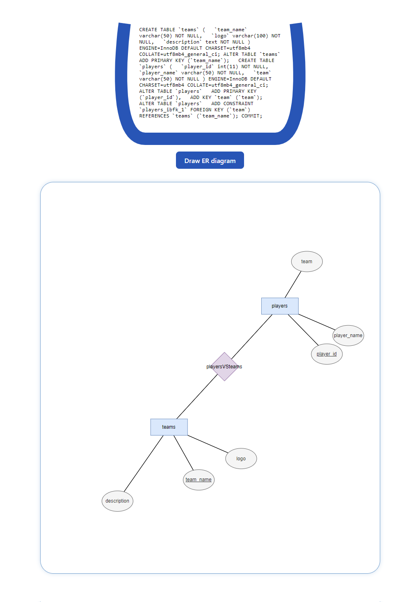

# 🧺 DERd - Draw Entity Relationship diagrams

DERd is a web application that parses SQL queries and uses a force-directed drawing algorithm to generate Entity Relationship (ER) diagrams, following Chen notation.

## 🚀 Technologies Used

- **Svelte**
- **DrawIO Integration**: Generates .drawio files and enables direct editing of diagrams with embedded DrawIO functionality on the spot.
- **Rust (Axum Framework)**
- **Sqlparser**: Rust library used for parsing.
- **Force-Directed Drawing Algorithm**: Used for creating ER diagrams in the client.

## 📷 Sample Image

  

## 🛠️ Features

- Generate an ER diagram from an SQL query (work in progress).

## 🤯 Challenges

- Tweaking the algorithm parameters for stability.
- Ongoing refinement for better results.
- Learning Rust and Axum framework for migrating the Express backend.
- Reverse engineering the DrawIO filetype to generate diagrams in a compatible format.

## 📈 Future Work

- Improve on the design and formatting of the input code.
- Accept uploaded SQL files.
- Optimize the drawing algorithm's performance (possibly using WASM).
- Achieve better stability and quality in generated diagrams.
- Implement more guardrails for the sent data.